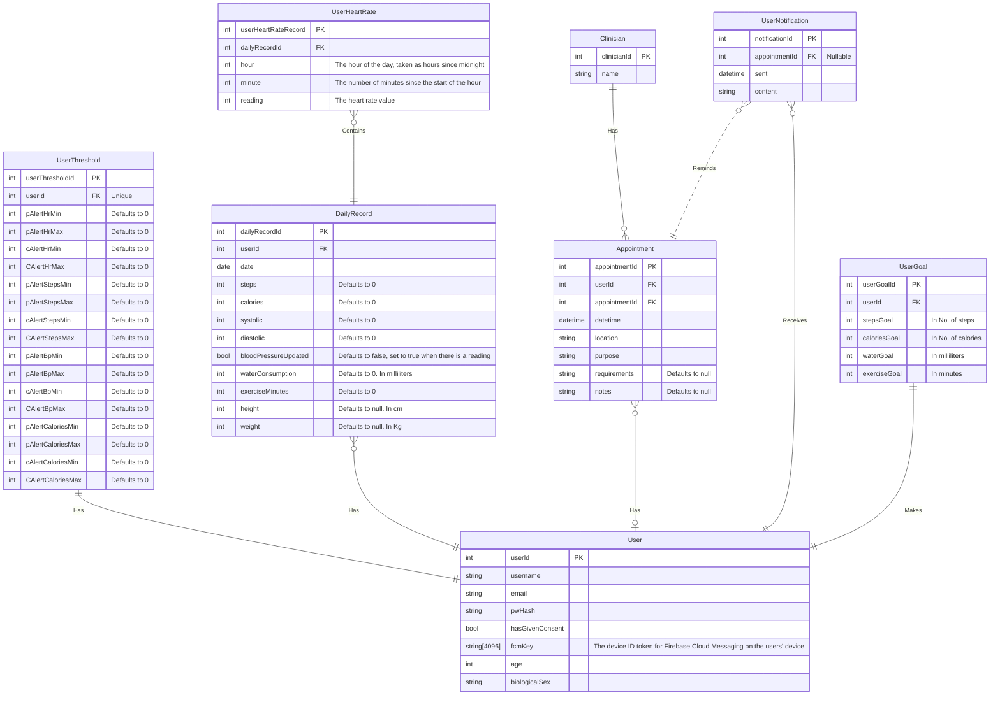

## Backend Structure explanation

1. *server.js* starts the API
2. *app.js* configures it
3. */routes* define endpoints
4. */controllers* handle endpoint logic


## How it will scale

As features are added we will follow the same pattern, e.g.

routes/biomarkers.routes.js
controllers/biomarkers.controller.js
services/biomarkersService.js
db/biomarkers.js


## Owen has explained firebase notifications in FIREBASE.md
Push notifications can now be sent by requiring: 
```js
const { sendNotification } = require("../services/fcm.services");
``` 
Then you can send the notifcation with:
- `token`: The FCM token of the user device
- `title`: The title of the notification
- `body`: The content of the notification

## ERD


There may still be tables that need to be added/changed in the ERD, however this is the most up to date version
---

## API Plan

All data fields in API Routes should be expected to be sent in the JSON format, with keys matching that which is specified in the plan.

### Signup

**Route**: /api/signup

**Methods**: POST

**Data**:
- username: string
- email: valid email address
- password: string
- age: integer, 0 < age > 255
- biologicalSex: string

**Returns**: 200, 400
- **200**: The user record was created successfully, and the user should be prompted to log in.
- **400**: The user record could not be created

---

### Login

**Route**: /api/login

**Methods**: POST

**Data**:
- username: string
- password: string

**Returns**: 200, 400
- **200**: The login request was successful. 
    - **Data**: userApiKey: A JWT that should be sent in all future requests to authenticate the client
- **400**: The login request failed. No extra detail is given for this error, as that could pose a security issue. By default, assume that the username and password were both invalid.

---

### Dashboard
When the dashboard first loads, it has a display showing:
- Heart Rate
- Steps
- Blood Pressure
- Calories
- Detailed history

This means that the data returned will need to be in the shape:
- heartRate
- steps
- systolic
- diastolic
- calories

**Route**: /api/dashboard

**Methods**: GET

**Data**:
- userApiKey

**Returns**: 200, 401
- **200**: The request was successful, and you will get the following JSON response:
    ```json 
    {
        "heartRate": 0,
        "steps": 0,
        "systolic": 0 to 255,
        "diastolic": 0 to 255,
        "calories": 0,
    }
    ```
- **401**: The request is invalid because the user token was not correct

---

### Dashboard Graph
Get the data for the dashboard graphs. Will return different data depending on the request sent.

**Methods**: GET

**Data**: 
```json
{
    "userApiKey": "",
    "type": int,
    "dateFrame", ""
}
```

Where:
- userApiKey: The users' api token
- type: the type of the data you want. This can be any one of the following
    | Biometric | Type Number |
    | :-------: | :---------: |
    | Heart Rate | 0 |
    | Steps | 1 |
    | Blood Pressure | 2 |
    | Calories | 3 |

    Any other number will result in a 400 error
- dateFrame: The timespan that you want to get the data for. This should be in the format `[int][string]`. With string being one of the following:
    | string | meaning |
    | :----: | :-----: |
    | d | Day |
    | w | Week |
    | m | Month |
    | y | Year |

    Any other value will result in a 400 error

    Int will represent the quanitity to return, e.g. 1d means returm 1 days worth of data, 1m is one months worth, etc.

**Returns**: 200, 400, 401
-**200**: The return of this route is as simple as possible, it is simply an array of values. These values will be oldest to newest.
```json
{
    "data": [int, int, int, int, ..., ...,]
}
```

-**400**: Either type or dateFrame contained invalid data. Check `message` for more details
-**401**: The userApiKey provided was invalid

---

### Get Thresholds

**Route**: /api/threshold/all

**Methods**: GET

**Data**:
- userApiKey

**Returns**:200, 401
-**200**: All thresholds for the user with the given `userApiKey`. 

As this route returns a large amount of data, an example is given of the return value, instead of a text description.

```json
{
    "0" : [int, int, int, int],
    "1" : [int, int, int, int],
    "2" : [int, int, int, int],
    "3" : [int, int, int, int]
}
```

where `0` is heart rate, `1` is steps, `2` blood pressure, `3` calories and, the content of each array is in the format:
| Position 0 | Position 1 | Position 2 | Position 3 |
| :--------: | :--------: | :--------: | :--------: |
| Patient Alert Minimum | Patient Alert Maximum | Clinician Alert Minimum | Clinician Alert Maximum |

-**401**: The userApiKey provided was invalid. 

---

### Set thresholds

**Route**: /api/threshold/set

**Methods**: POST

**Data**:
```json 
{
    "userApiKey": "",
    "data": {
        "0" : [int, int, int, int],
        "1" : [int, int, int, int],
        "2" : [int, int, int, int],
        "3" : [int, int, int, int]
    }
}
```

where `0` is heart rate, `1` is steps, `2` blood pressure, `3` calories and, the content of each array is in the format:
| Position 0 | Position 1 | Position 2 | Position 3 |
| :--------: | :--------: | :--------: | :--------: |
| Patient Alert Minimum | Patient Alert Maximum | Clinician Alert Minimum | Clinician Alert Maximum |

All values supplied must be valid integers, and all values will be used to update the user record. 

**Returns**: 200, 400, 401
- **200**: The thresholds data has been successfully updated
- **400**: The data supplied was invalid. Likely one of the values provided was not an integer. See the `message` item in the response for details
- **401**: The userApiKey supplied is invalid. See the `message` item in the response for details

---

### User Notification
Get all notifications for the user whose userId is in the userApiKey
**Route**: /api/notifications

**Methods**: GET

**Data**:
- userApiKey

**Returns**:200, 401
- **200**:
A JSON array of notifcations for the current user. In the format:
```json
{
    "notifications": {
        notification-id: {
            "appointment": false,
            "sent": "19/02/2026 12:03",
            "content": "notification content here"
        },

        notification-id: {
            "appointment": true,
            "appointment-id": appointmentId,
            "sent": "18/02/2026 09:00",
            "content": "notification content here"
        },
    }
}
```

Where notifications appear in this array in the order, newest at the top, oldest at the bottom.

- **401**: THe userApiKey provided was invalid.

---

### Upload data
Upload a single piece of data into the users' latest daily record. If no record exists, one will be created.

**Route**: /api/data/upload

**Methods**: POST

**Data**:
- userApiKey
- type: the type of the data you want to upload. This can be any one of the following
    | Biometric | Type Number |
    | :-------: | :---------: |
    | Heart Rate | 0 |
    | Steps | 1 |
    | Blood Pressure | 2 |
    | Calories | 3 |
    | Water consumption | 4 |
    | Height | 5 |
    | Weight | 6 |

    Any other number will result in a 400 error
- data: the format of `data` will be different depending on what type you are updating.

    Refer to the table below for details 
    | Biometric         | Type | Data expected            | Description |
    | :-------:         | :--: | :-----------:            | :---------: |
    | Heart Rate        | 0    | `{ "data" : {int} }`     | In beats per minute |
    | Steps      | 1 | `{ "data": {int} }`      | In no. of steps |
    | Blood pressure    | 2    | `{ "data": {int, int} }` | int1 = systolic, int2 = diastolic |
    | Calories          | 3    | `{ "data": {int} }`      | In no. of calories |
    | Water consumption | 4    | `{ "data": {int} }`      | In mililitres |
    | Height            | 5    | `{ "data": {int} }`      | In meters |
    | Weight            | 6    | `{ "data": {int} }`      | In Kg |

**Returns**:200, 201, 400, 401
-**200**: All data was correct and the record has been updated
-**201**: All data was correct, but no daily record yet existed in the user account. A new one has been created and the data has been put in it
-**400**: Either an invalid `type` was supplied, or `data` contained illegal, not enough, or too many values. See `message` for the exact cause of the error
-**401**: The userApiKey provided was invalid

---

### Copy/Paste

**Route**: /api/

**Methods**:

**Data**:
-

**Returns**:
-

